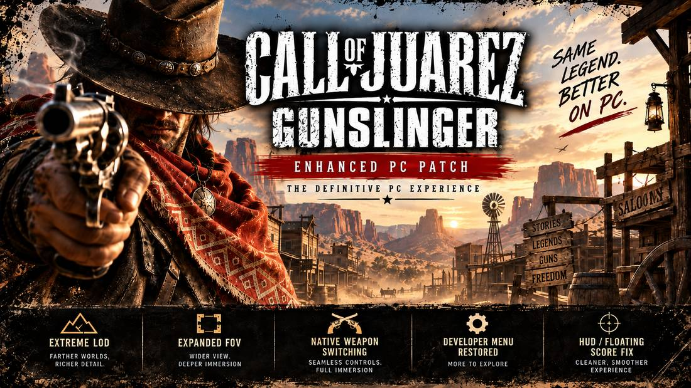
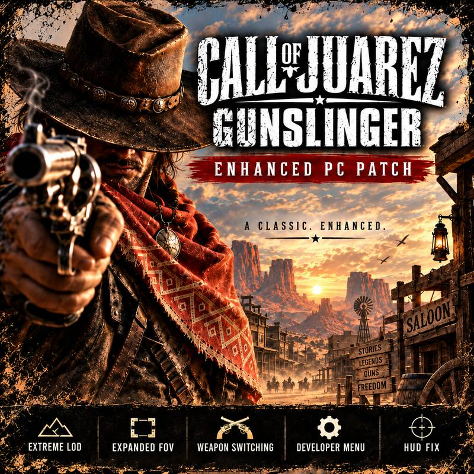

# Call of Juarez: Gunslinger - Enhanced PC Patch

<p align="center">
  
</p>

<p align="center">
  
</p>


Source repository for the **Enhanced PC Patch** for *Call of Juarez: Gunslinger*.

The current validated game payload is **Steam v45 / GOG v45**. The unified installer is now versioned independently from the game payloads.

Current version designation:

`v2Pv45Sv45G`

- `v2P` = patcher generation 2
- `v45S` = Steam payload v45
- `v45G` = GOG payload v45

> Steam v45 and GOG v45 are binary-identical to their respective validated Build 44 gameplay references. The v45 milestone unified distribution only; it did not change the validated game-code payload.

## What the patch improves

The cumulative patch includes:

- enhanced draw distance, LOD and high-end graphics settings;
- native horizontal FOV range extended to **80-120**, with **100** as the default when no explicit value is configured;
- improved keyboard controls and remappable weapon switching;
- Weapon Trick and weapon drop/throw keyboard support;
- Developer Menu access and related UI fixes;
- Auto Reload / Manual Reload improvements and Hold Quick Reload;
- controller Hold Quick Reload support;
- HUD layout and scaling corrections;
- centered reload prompt with corrected native spacing;
- surgical Combo / Upgraded-card visibility handling;
- Arcade score-HUD visibility handling;
- startup high-CPU fix using the engine's empty Win32 message-queue path.

The patch intentionally preserves unrelated game behavior instead of applying broad global hooks.

### Platform preservation

**Steam** keeps its Steam integration and supported ULC entitlements.

**GOG** keeps the GOG executable entry point/platform integration and its GOG-specific menu resources. The GOG branch does not inject Steam DRM, Steam platform code or Steam-only menu navigation.

## Installation

The current validated installer logic:

1. is placed next to `CoJGunslinger.exe`;
2. locates `coj4/Data0.pak` or `Data0.pak` beside the EXE;
3. hashes both source files;
4. accepts only an exact supported Steam or GOG pair;
5. creates backups;
6. applies the matching embedded `COJDP1` direct deltas;
7. verifies the reconstructed target before installation;
8. stages and installs both files;
9. verifies the installed hashes again.

Accepted sources:

- exact original Steam files;
- exact Steam Enhanced PC Patch Build 15 pair;
- exact original GOG files;
- the current validated Steam or GOG target, detected as already installed.

Unknown, modified or mixed edition pairs are rejected **before modification**.

## Safety and source review

The Windows patcher is built from this repository with PyInstaller.

It:

- contains no retail game executable or retail `Data0.pak`;
- contains compact binary deltas only;
- does not download game files;
- does not require network access;
- does not install a service or driver;
- does not request administrator privileges itself;
- modifies only a recognized local game pair;
- verifies the exact source SHA-256 before applying a direct delta;
- creates `.Backup` copies before installation;
- reconstructs and verifies the new pair before replacement;
- keeps a temporary rollback pair during replacement;
- verifies the installed hashes one final time.

Because the tool patches an executable and a game archive, automated malware scanners may treat the packaged patcher conservatively. The complete installer source and GitHub Actions build workflow are provided for review.

## Versioning

The installer and the two game payloads are versioned independently.

Format:

`v<PATCHER>Pv<STEAM>Sv<GOG>G`

Current designation:

`v2Pv45Sv45G`

This prevents a packaging-only patcher revision from pretending that the Steam or GOG gameplay payload changed.

The release/tag naming scheme is the full designation, so the current distribution is `v2Pv45Sv45G`. The superseded `v45` packaging release is not part of the current distribution.

## Validated v45 hashes

### Steam

| File | Original Steam | Steam v45 target |
| --- | --- | --- |
| `CoJGunslinger.exe` | `ca1c4766900feb867372e0e2e87eb5adb92ca26ee537598a034ed7be1313d93c` | `125a3b088e502049913d7a6d20f0ad76d7a0e5fe086d14bb257c4d0798ca5844` |
| `Data0.pak` | `0debd38c1560830486d8f7bdecf3806324e4f6357f1353ea0058b47bdfe8aa3b` | `55cab794160a244ef3db3abfa0e3beb23643ebb20c3d95831d0c553905372744` |

### GOG

| File | Original GOG | GOG v45 target |
| --- | --- | --- |
| `CoJGunslinger.exe` | `c061b0cd177c04e9ae30bdd5b8693caff2c2474b8f48f8d9c7e2bcd05f817708` | `c0cc2bcb760e5b6fff9e6f0ab5e4ccf3acec5859f08f11a77339f551501a45e4` |
| `Data0.pak` | `7c5b83bc26a703abe4a55d460b73d0248168d16e7b2998d0d6e8a45244a03e60` | `601fdb9311635352af663b7c10959b263f5650a463f4dc20f1b54b390273d62b` |

See `HASHES_BUILD45.json` for the machine-readable manifest.

## Current reconstruction architecture

The active installer no longer uses the historical semantic Build 15 -> Build 44 chain at runtime.

It embeds **six independent direct COJDP1 deltas**:

- Steam retail EXE -> Steam v45 EXE
- Steam retail Data0 -> Steam v45 Data0
- Steam Build 15 EXE -> Steam v45 EXE
- Steam Build 15 Data0 -> Steam v45 Data0
- GOG retail EXE -> GOG v45 EXE
- GOG retail Data0 -> GOG v45 Data0

Each COJDP1 stream contains the expected source size/SHA-256 and target size/SHA-256. The installer also performs its own edition-level hash checks before and after installation.

### GOG target provenance

The validated GOG PE layout keeps the GOG entry point and platform integration. An inert zero-filled padding section reserves the address range absent without Steam's `.bind` section, allowing the common validated `.mod` payload to retain its established addresses without copying Steam DRM code.

The original Steam and GOG `Data0.pak` archives both contain 1774 entries. They differ in four GOG-specific menu resources, none of which belongs to the 19-resource gameplay patch set. The validated GOG v45 target therefore preserves those GOG-specific resources.

## Repository layout

```text
.github/workflows/          Windows build and release workflows
installer/                  Active unified Steam + GOG patcher source
legacy/                     Retired reconstruction chains kept for audit/history
HASHES_BUILD45.json         Current Steam + GOG integrity manifest
docs/TECHNICAL_NOTES.md     Validated implementation and lineage notes
release/                    Release metadata
```

The retired reconstruction chains are kept only under `legacy/` for auditability and historical reference. They are not part of the active installer architecture or packaged patcher.

Packaged mod ZIPs and retail game files are intentionally **not stored in this repository**. Public binaries are published through GitHub Releases / Nexus Mods.

## Technical notes

See `docs/TECHNICAL_NOTES.md` for the retained native hooks, payload lineage and distribution architecture.
